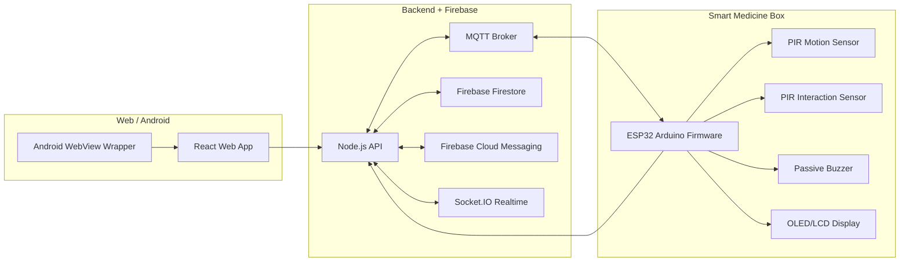

# System Architecture

## Data flow

- Web app writes schedules, users, assignments, and devices.
- Backend persists the state and publishes reminder sync payloads over MQTT.
- ESP32 receives schedule updates, maintains the clock locally, and triggers buzzer/display updates immediately.
- PIR events and box interactions flow back to the backend through MQTT.
- Backend writes events into Firebase and broadcasts realtime updates to the web app.
- FCM sends alerts to caretaker Android devices even when the app is closed.
